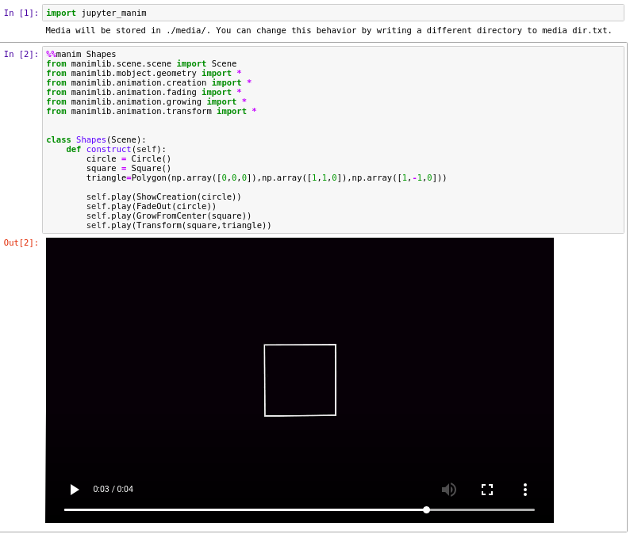

# jupyter-manim
[](https://travis-ci.org/krassowski/jupyter-manim)
[](https://codecov.io/gh/krassowski/jupyter-manim)
[](http://choosealicense.com/licenses/mit/)
[](https://mybinder.org/v2/gh/krassowski/jupyter-manim/master?filepath=Example.ipynb)

Integrates [manim](https://github.com/3b1b/manim) (animation engine for explanatory math videos)
with Jupyter displaying the resulting video when using `%%manim` cell magic to wrap a scene definition.

### Quick preview



The code in the example above comes from the excellent [manim tutorial](https://github.com/malhotra5/Manim-Tutorial).

Run a live demo in your browser [by clicking here](https://mybinder.org/v2/gh/krassowski/jupyter-manim/master?filepath=Example.ipynb).

### Installation

```sh
pip3 install jupyter-manim
```

### Usage

To enable the manim magic please run `import jupyter_manim` first. Then, you can use the magic as if it was the manim command: your arguments will be passed to manim, exactly as if these were command line options.

For example, to render scene defined with class `Shapes(Scene)` use

```python
%%manim Shapes
from manimlib.scene.scene import Scene
from manimlib.mobject.geometry import Circle
from manimlib.animation.creation import ShowCreation

class Shapes(Scene):

    def construct(self):
        circle = Circle()
        self.play(ShowCreation(circle))
```


Since version 1.0, the code is no longer required to be self-contained -
`jupyter_manim` will attempt to export your variables (and imported objects) from the notebook into the manim script.

Most variables can be easily exported, however there are limitations; in short [everything which can be pickled](https://docs.python.org/3/library/pickle.html#what-can-be-pickled-and-unpickled) can be exported. Additionally, variables whose names start with an underscore will be ommited.


To display manim help and options use:

```
%%manim -h
pass
```


The `%%manim` magic (by default) hides the progress bars as well as other logging messages generated by manim.
You can disable this behaviour using `--verbose` flag


In the latest version of manimlib you can import everything at once using:

```python
from manimlib.imports import *
```

#### Video player control options

 - `--no-controls` - hides the controls
 - `--no-autoplay` - disables the autoplay feature
 - `-r` or `--resolution` - control the height and width of the video player;
  this option is shared with manim and requires the resolution in following format:
  `height,width`, e.g. `%%manim Shapes -r 200,1000`
 - `--base64` send the video with a `data:` URL instead of a local path - useful for remote notebooks like Google Colab,
 or to embed the video in notebook (note: the notebook size may increase rapidly)


### Compatibility and testing

This package is continuously tested with Python 3.7 on Ubuntu, Mac OS an Windows.

Tests have to be run with ipython, as the magic relies on IPython instance being available:

```bash
python3 setup.py install
ipython -m pytest -- --cov=.
```
